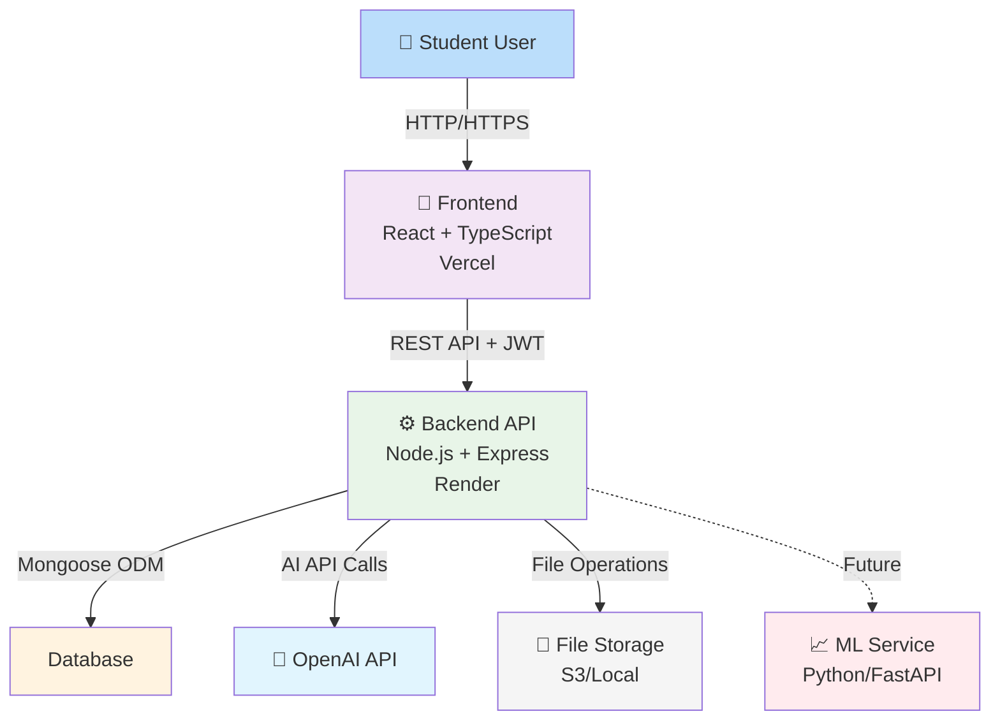

# ai-study-companion
📘 AI Study Companion

AI Study Companion is a full-stack, AI-powered learning platform designed to help university students study more effectively. The application allows users to upload lecture notes, interact with an AI tutor, generate quizzes, and receive personalized study recommendations using machine learning.

The project is built with a MERN stack architecture and is designed to be easily extended into a mobile application.

🚀 Features

🔐 User authentication (secure login & registration)

📄 Upload and manage lecture notes (PDF/text)

🤖 AI-powered features:

Note summarization

Question answering (AI tutor)

Automatic quiz generation

📊 Progress tracking and performance analysis

🧠 Personalized study recommendations using machine learning

📱 Mobile-ready architecture (React → React Native)

🛠️ Tech Stack
Frontend

React.js

Context API

Tailwind CSS / Material UI

Backend

Node.js

Express.js

MongoDB

JWT Authentication

AI & Machine Learning

Generative AI (OpenAI / Hugging Face)

NLP for text processing

Machine Learning models for topic recommendation

Python + FastAPI (ML microservice)

🧱 Project Architecture

The project is organized into three main components:

Frontend (React)
        ↓
Backend API (Node.js + Express)
        ↓
MongoDB Database
        ↓
AI Services & ML Microservice (Python/FastAPI)
## 🏗️ System Architecture



### Detailed Architecture Diagram
[](.github/assets/architecture.drawio)

*Click the diagram above to view/edit interactively on GitHub*

### Components Overview

| Component | Technology | Purpose | Hosting |
|-----------|------------|---------|---------|
| **Frontend** | React + TypeScript + Tailwind | User interface for note upload, chat, quizzes | Vercel |
| **Backend API** | Node.js + Express + TypeScript | REST API, authentication, business logic | Render/Railway |
| **Database** | MongoDB Atlas | Store users, notes, quizzes, progress | MongoDB Cloud |
| **AI Service** | OpenAI API (GPT-3.5/4) | Summarization, Q&A, quiz generation | OpenAI |
| **File Storage** | Local (dev) / S3 (prod) | Store uploaded PDFs and extracted text | AWS/Local |
| **ML Service** | Python + FastAPI | Recommendations & analytics (Phase 2) | Render |

### Data Flow
1. **User → Frontend** (HTTP/HTTPS): User interacts with React app
2. **Frontend → Backend** (REST API): API calls with JWT authentication
3. **Backend → Database** (Mongoose): Data persistence operations
4. **Backend → OpenAI**: AI processing for summaries/quizzes
5. **Backend → File Storage**: Upload/download PDF files
6. **Backend → ML Service**: Analytics (Phase 2)

### API Structure
```
/auth          POST   /register, /login, /logout
/notes         GET    / (list), POST /upload, DELETE /:id
/ai            POST   /summarize/:noteId, /chat/:noteId, /quiz/:noteId
/quizzes       GET    /:id, POST /:id/submit
/progress      GET    / (dashboard), GET /:topic
```

This modular design ensures scalability, maintainability, and easy transition to mobile platforms.

📁 Repository Structure
ai-study-companion/
├── client/        # Frontend (React)
├── server/        # Backend (Node + Express)
├── ml-service/    # Machine Learning microservice (Python)
├── docs/          # Documentation
└── README.md

🎯 Project Goals

Build a real-world AI-powered application using modern web technologies

Apply Generative AI and Machine Learning in a practical context

Demonstrate full-stack engineering skills

Create a scalable system suitable for web and mobile platforms

📱 Mobile Expansion

The frontend is designed to be migrated to React Native with minimal changes.

The backend and AI services remain unchanged, enabling rapid mobile deployment.

👤 Author

Developed by Hiba Ahmedh.

Background: Web Development | AI & Machine Learning Enthusiast

📄 License

This project is licensed under the MIT License.
